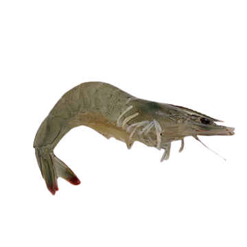
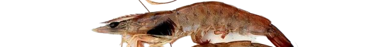
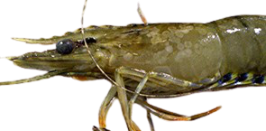

# Shrimp Disease Classification & Behavior Detection

Computer vision for aquaculture: classifying shrimp diseases from images with transfer learning, and detecting abnormal feeding behavior — my BSc graduation project (University of Greenwich / MSA University), published as a peer-reviewed IEEE paper.

<p align="center">
  
  
  
  <br/><em>Healthy · Black gill · White spot</em>
</p>

## 📄 Publication

**Shrimp Disease Classification Using Transfer Learning Models** — *IEEE, 2022*

A comparative study of transfer learning architectures for shrimp disease diagnostics, developed in collaboration with domain biologists on real aquaculture data.

## 🔬 Why it matters

Disease outbreaks are a major loss driver in shrimp farming, and expert visual inspection does not scale. This project benchmarks six architectures head-to-head for disease classification, and adds a behavior-analysis track for early warning from feeding patterns.

## 📂 Repository structure

```
notebooks/
  diseases/        # transfer learning benchmark - one notebook per architecture
    Inception_v3.ipynb · MobileNetV2.ipynb · VGG16.ipynb
    ResNet50.ipynb · MobileNetV1.ipynb · CNNS.ipynb (baseline CNN)
  behaviors/       # feeding-behavior classification (PyCaret)
data/
  behaviors_features.xlsx   # extracted behavior features
assets/samples/    # sample images per class
Thesis.pdf         # full BSc thesis: methodology, experiments, results
```

Each disease notebook is self-contained: data loading, fine-tuning of the pretrained backbone, training curves, and evaluation (accuracy, confusion matrix) on the shrimp disease dataset.

## ⚙️ Stack

TensorFlow/Keras · transfer learning (ImageNet backbones) · PyCaret · OpenCV

**Note:** the full image dataset and trained weights are not included for size reasons — sample images are provided in `assets/samples/`. Contact me for access: abdelaziz.ashraf.wahid@gmail.com

## 📚 Citation

```bibtex
@inproceedings{hussein2022shrimp,
  title={Shrimp Disease Classification Using Transfer Learning Models},
  author={Hussein, Abdelaziz and others},
  booktitle={IEEE},
  year={2022}
}
```

## 👤 Author

**Abdelaziz Hussein** — [Google Scholar](https://scholar.google.com/citations?user=IcqqORIAAAAJ) · [ORCID](https://orcid.org/0000-0001-9532-2958)
